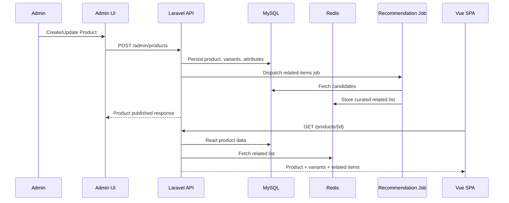
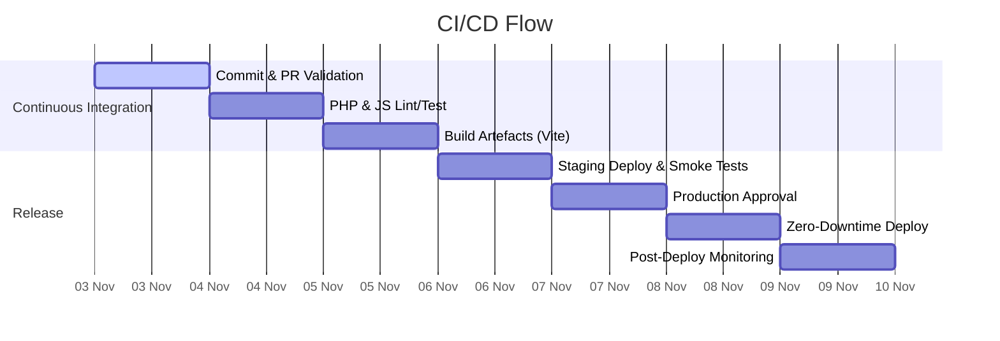
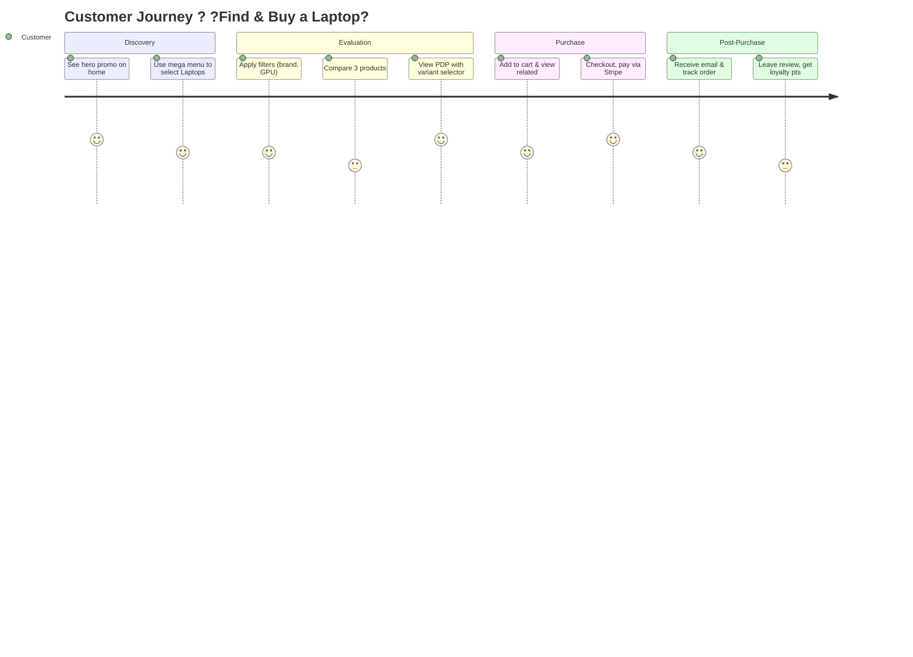

## 002 ? Visual Blueprints

> Render these diagrams in any Mermaid-enabled Markdown viewer (e.g., VS Code with Mermaid preview).

### System Architecture Overview
```mermaid
flowchart TB
    subgraph Client
        A[Browser / Vue SPA]
        B[SSR Edge / SEO Bots]
    end
    subgraph Delivery
        C[Vite Build Output
        (JS/CSS/Assets)]
        D[CDN]
    end
    subgraph Platform
        E[Apache
        (Reverse Proxy)]
        F[PHP-FPM
        + Laravel 12]
        G[Node LTS
        (Build Pipeline)]
    end
    subgraph Core Services
        H[(MySQL 8)]
        I[(Redis)]
        J[(Search Engine
        Meilisearch/Algolia)]
        K[(Object Storage / CDN origin)]
    end
    subgraph External Integrations
        L[Payment Gateway
        (Stripe/Adyen/PayPal)]
        M[Shipping APIs
        (Shippo/EasyPost)]
        N[Analytics & Monitoring
        (GA4, Sentry)]
    end

    A -->|Hydrate| C
    B -->|SSR Cache| E
    C --> D --> A
    E --> F
    F --> H
    F --> I
    F --> J
    F --> K
    F --> L
    F --> M
    F --> N
```

### Catalog & Recommendation Data Flow


### DevOps & Deployment Pipeline


### Experience Journey Snapshot

